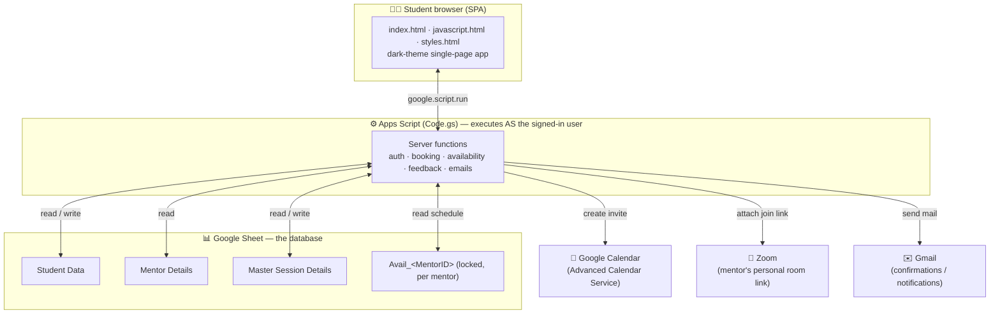
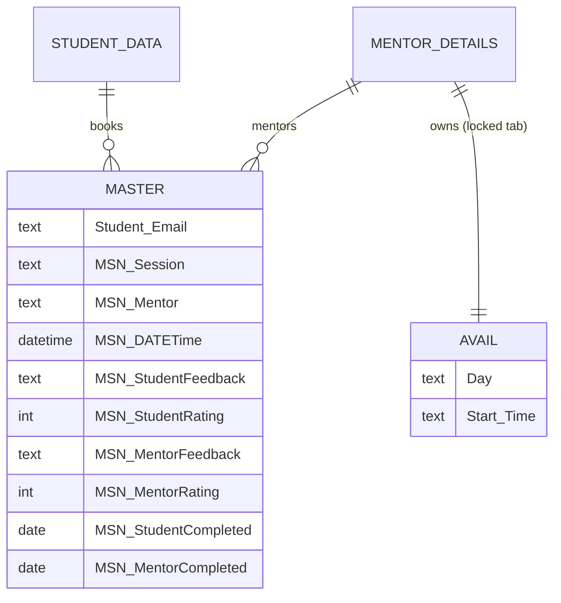
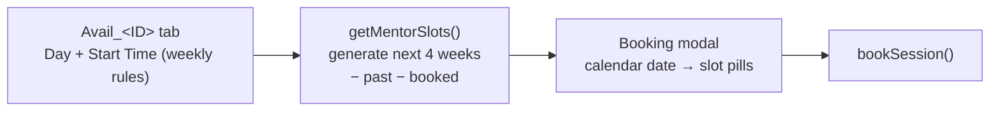
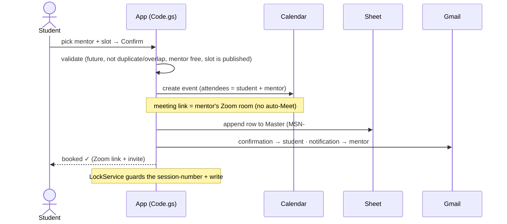
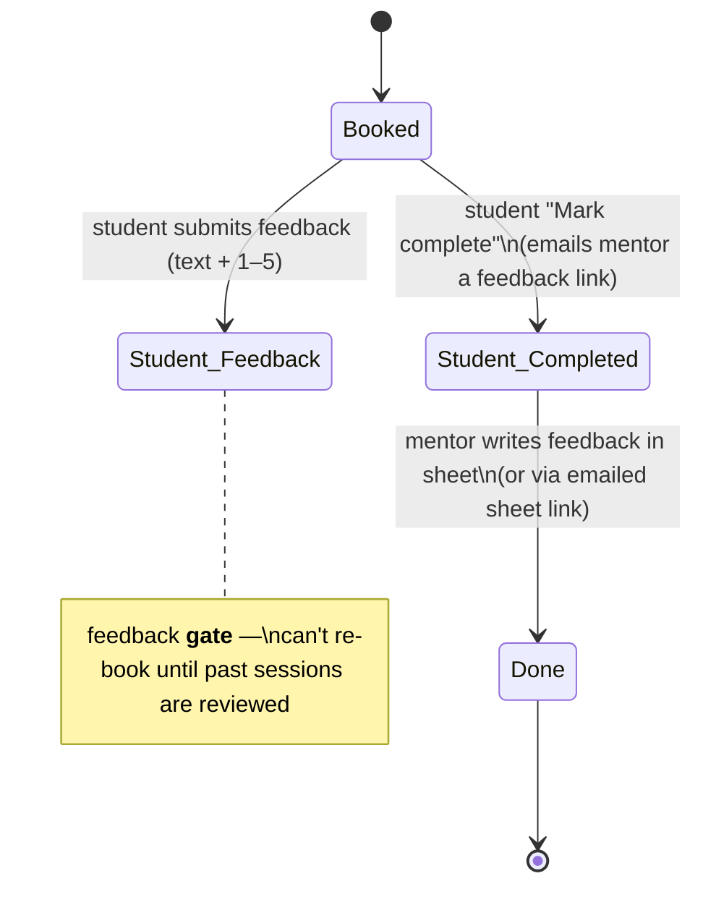

# Architecture Overview

SSB Mentorship Booking Portal — how the pieces fit, the data model, and the core workflows.
Diagrams are [Mermaid](https://mermaid.live) (render in any Mermaid-aware viewer).

---

## 1. System architecture

A single **Google Apps Script web app** is the whole backend + frontend. A **Google Sheet**
is the database. Google **Calendar**, **Zoom**, and **Gmail** are the integrations.

**Key property:** the web app is deployed **"execute as the user accessing it."** So each request
runs as that student's Google identity — which is how silent login works and why the project is
**owned by an `ssb.scaler.com` account** (same domain as the reviewer → no third-party app block).

---

## 2. Data model (Google Sheet)

The code maps columns **by header name** (order can change, spelling can't).

| Tab | Columns | Purpose |
|---|---|---|
| **Student Data** | `Student Email`, `Full Name`, `Roll No`, `Batch` | Registered students (login lookup) |
| **Mentor Details** | `ID`, `Name`, `Email`, `LinkedIn`, `University`, `Education Stream`, `Current Role`, `Current Organization`, `Skills`, `PhotoLink`, `MeetingLink`, `Year of Exp` … | Mentor profiles |
| **Master Session Details** | `Student Email`, `Full Name`, `Roll No`, `Batch`, `Meetlink`, `MSN Session`, `MSN-Mentor`, `MSN-DATETime`, `MSN-StudentFeedback`, `MSN-StudentRating`, `MSN-MentorFeedback`, `MSN-MentorRating`, `MSN-StudentCompleted`, `MSN-MentorCompleted` | Every booked session + its feedback + completion state |
| **Avail_&lt;MentorID&gt;** | `Day`, `Start Time` | Each mentor's **recurring weekly** availability (locked to that mentor) |

---

## 3. Availability → bookable slots

The mentor stores a **fixed weekly schedule** (e.g. Mon/Wed/Fri × 17:00, 18:00). The server
expands those rules into concrete, dated slots for the next **4 weeks**, dropping past times and
already-booked ones. The student sees a **calendar date picker** + the slots for the chosen day.

---

## 4. Booking workflow

---

## 5. Completion & feedback workflow (the state machine)

Mentor feedback unlocks only when **both** sides confirm the meeting happened.

- **Student feedback:** stored in `MSN-StudentFeedback` / `MSN-StudentRating`. A **gate** blocks
  booking again until past completed sessions are reviewed.
- **Mentor feedback:** stored in `MSN-MentorFeedback` / `MSN-MentorRating`, entered in the sheet
  (directly, or via the **Open the feedback sheet** link in the email).
- Both feedbacks are visible to the student in the **feedback viewer**.

---

## 6. Integrations & automation

| Integration | Use | How |
|---|---|---|
| **Google Calendar** | Session invite to both parties | Advanced Calendar Service `Events.insert` |
| **Zoom** | The actual meeting room (join link) | Mentor's personal room URL stored in `MeetingLink` |
| **Gmail** | Confirmation, mentor notification, feedback request | `GmailApp.sendEmail` (HTML) |
| **Google Sheet** | Database (read/write live) | `SpreadsheetApp`, header-mapped |

**Automation built in**
- Auto meeting + invite + 3 emails on booking / completion.
- **Recurring slot generation** (4 weeks) from weekly rules — no manual dated entries.
- **`onEdit` format guard** — normalizes the mentor's typed `Day`/`Start Time` (e.g. `mon`→`Monday`, `5pm`→`17:00`).
- **Idempotent setup** — `setupEverything` / `provisionAllMentorSheets` / `verifySetup` re-run safely.

---

## 7. Reliability & scalability

**Reliability**
- `LockService` serializes booking writes → no duplicate session numbers / race double-books.
- Validations: past-date, duplicate, student-overlap, **mentor double-booking**, slot-must-be-published.
- Email/sheet side-effects wrapped in `safe_` so a failure never breaks the booking.

**Scalability & trade-offs**
- **Sheet-as-DB** is transparent, zero-cost, and ideal at cohort scale (hundreds of students,
  thousands of sessions). It is *not* a high-write transactional DB — for tens of thousands of
  concurrent bookings you'd migrate to Firestore/Postgres. The header-mapped access layer keeps
  that migration localized to the data functions.
- **Per-mentor availability tabs** scale linearly with mentors and keep each schedule isolated + lockable.

---

## 8. Security model

- **Allowlist** (`ALLOWED_STUDENTS`) — explicit control over who can log in.
- **Silent identity** — `Session.getActiveUser().getEmail()`; org-domain ownership makes same-domain
  users' identity reliable (and blocks impersonation — you are who you're signed in as).
- **Locked availability tabs** — protected ranges; only the assigned mentor edits their schedule.
- **Per-row ownership checks** — students act only on their own sessions; mentor feedback is matched to the mentor email.
